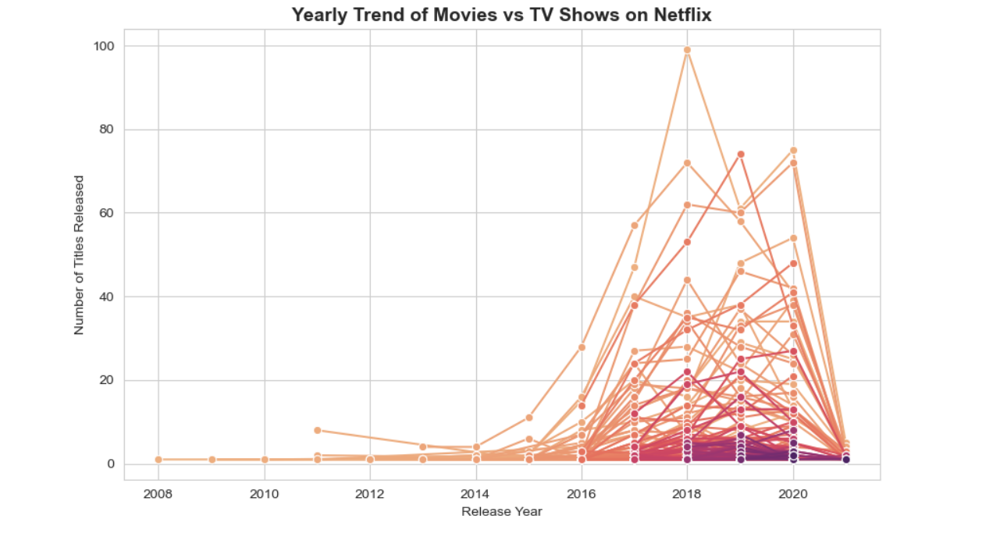
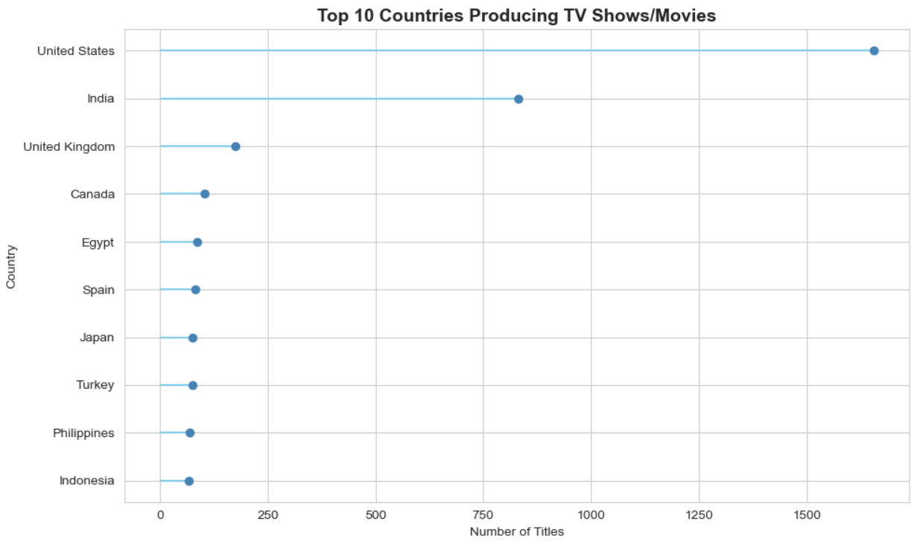
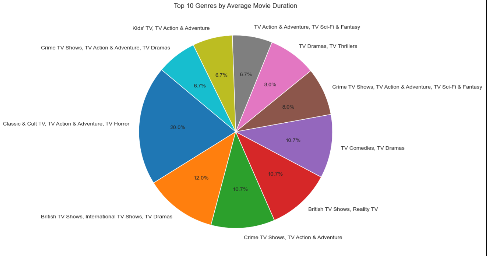

<!-- README.md -->

<h1 align="center">
  
</h1>

---

<p align="center">
  
  
  
  
</p>

---

## 🧠 **Project Overview**

This project dives deep into the **Netflix dataset**, exploring its movies and TV shows to uncover meaningful trends in content type, rating, country distribution, and release patterns.

It focuses on:
- Data cleaning and preprocessing  
- Exploratory data analysis (EDA)  
- Visualization of trends using **Matplotlib** and **Seaborn**

---

## 🧩 **Tech Stack**

| Tool | Description |
|------|--------------|
| **Python** | Core programming language |
| **Pandas** | Data manipulation and analysis |
| **NumPy** | Numerical computation |
| **Matplotlib / Seaborn** | Visualization and insights |
| **Jupyter Notebook** | Interactive data analysis |

---

## 📂 **Dataset Overview**

| Feature | Description |
|----------|--------------|
| `Show_Id` | Unique ID for each show |
| `Category` | Movie or TV Show |
| `Title` | Name of the content |
| `Director`, `Cast`, `Country` | Metadata |
| `Release_Date` | Date of release |
| `Rating` | Content rating (TV-MA, R, PG, etc.) |
| `Duration` | Movie duration or TV seasons |
| `Type` | Genre information |
| `Description` | Short summary |

**Dataset Shape:** `(7789, 11)` → after cleaning → `(4811, 11)`

---

## 🧹 **Data Cleaning Steps**

1. **Handled Missing Values** – Dropped rows with nulls in key columns.  
2. **Converted Dates** – Parsed `Release_Date` into datetime format.  
3. **Extracted Numeric Duration** – Created `Duration_final` for analysis.  
4. **Standardized Columns** – Ensured data uniformity.

---

## 📊 **Data Visualization**

Here are some of the visual insights extracted:

### 🎞️ Category Distribution by Rating
```python
sns.countplot(x=df['Category'], hue=df['Rating'])
```
Shows how Movies dominate across ratings like TV-MA, TV-14, etc.

### 🌍 Top 10 Countries Producing Content
```python
sns.countplot(y='Country', data=df[df['Country'].isin(top_countries)], order=top_countries)
```
United States and India lead by a large margin in Netflix productions.

### ⏱️ Average Duration by Genre

Pie chart visualization of top genres by average movie duration.

### 📈 Yearly Trend of Releases
```python
sns.lineplot(data=yearly, x='Year', y='Count', hue='Type', marker='o', palette='flare')
```
A beautiful line graph showing the growth of movies vs TV shows over time.

### 🔥 Rating vs Duration Heatmap
```python
sns.heatmap(heat_data, cmap='YlGnBu')
```
Visualizes correlation between content ratings and duration.

## 📸 Sample Visuals





## 🚀 Key Insights

 - 🎬 Movies dominate Netflix’s catalog (over 90% of titles).

 - 🌍 US & India contribute most to Netflix’s global library.

 - ⏳ Average movie duration ≈ 93 minutes.

 - 📅 Significant growth in releases from 2015–2020.

 - 🔞 Majority of content rated TV-MA (Mature Audience).

## 🧭 Future Scope

 - Integrate interactive dashboards (Plotly / Streamlit).

 - Add recommendation engine using ML.

 - Automate data updates via API or web scraping.

   

